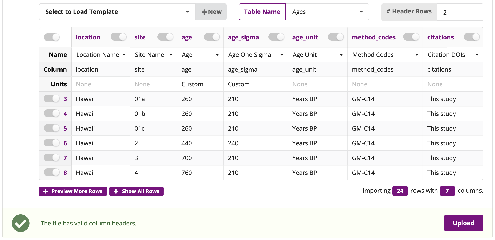
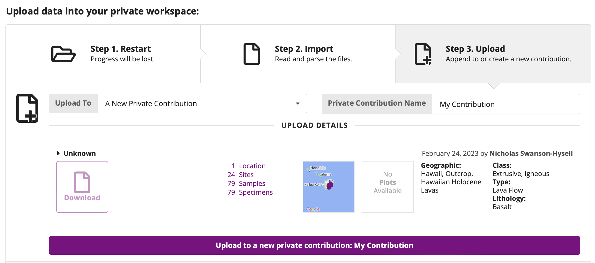
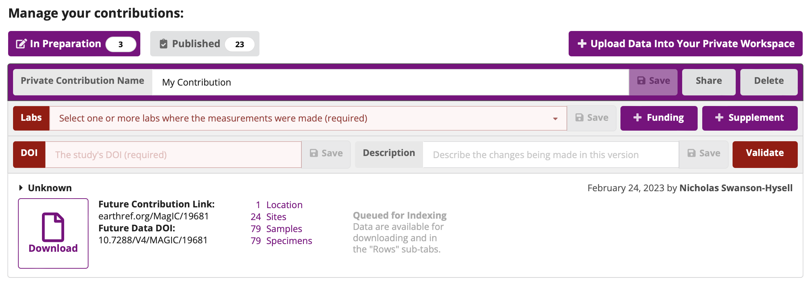
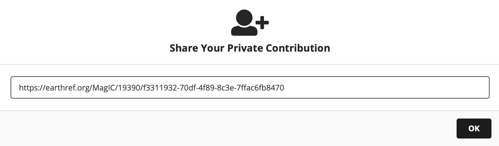

# Part 1: Anatomy of a MagIC contribution

1. Log-in to MagIC/Earthref (https://www2.earthref.org/MagIC)
2. Go to upload tool (https://www2.earthref.org/MagIC/upload)
3. Download and examine contribution 

   
4. Go to Data model to learn table/column names (https://www2.earthref.org/MagIC/data-models/3.0)
5. Go back to main upload page and let's drag and drop the file to upload

   
6. Upon uploading, we can examine the tables which are parsed and matched up with the table name and data model fields

   
7. Click the upload button in the lower right, which will bring you to an upload page where you can click through to upload data into your private workspace
   
   
8. Here we can add the DOI for the study which is `10.1029/93JB00024` (then click save), add the lab for the study `Paleomagnetic Laboratory (USGS Menlo Park, USA)`, and then click to validate the contribution
   
   
9. Once the study is validated, a contribution can be published (let's not do that here as this study is already in MagIC) or for a private contribution a private link can be shared. Sharing such a link enables data to be made available for peer review. Note that the DOI for the contribution (Future Data DOI) is already available at this stage which enables the data to be properly referenced within a manuscript when it is submitted. 

   

# Part 2: Inspecting a contribution using PmagPy