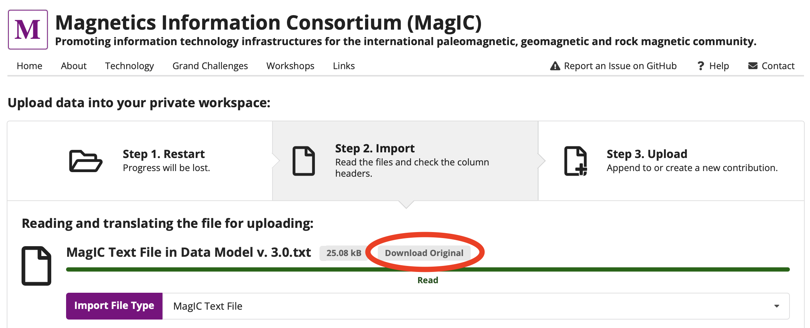

# Anatomy of a MagIC contribution

1. Log-in to MagIC/Earthref (https://www2.earthref.org/MagIC)
2. Go to upload tool (https://www2.earthref.org/MagIC/upload)
3. Download and examine contribution 

   
4. Go to Data model to learn table/column names (https://www2.earthref.org/MagIC/data-models/3.0)
5. Go back to main upload page and let's drag and drop the file to upload
